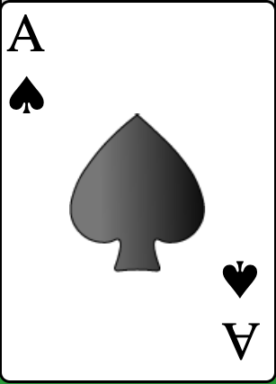
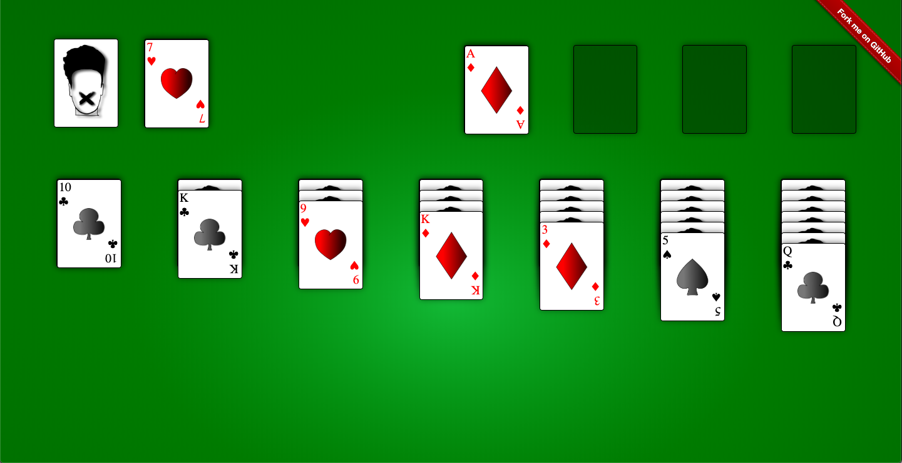

### Drag and Drop

- Drag and drop is implemented with native html5 drag and drop api with @drag, @dragend, @dragenter eventlisteners on the Card.vue component.
- Libraries like Vue.draggable were not used as i had to write most of the drag and drop logic according to the solitaire game type and I also had to **MOVE** the stack of cards.
- Ghost image in drag is removed instead the **whole stack** of card moves with cursor change.

### CSS

- Each and every card is 100% css except the SVG of the suit in the center of the card,which is made by illustrator tool.

  <p align="center"></p>


## **Klondike**

<p align="center">

</p>
<!--  -->


## Project setup

```
npm install
npm run serve
```


